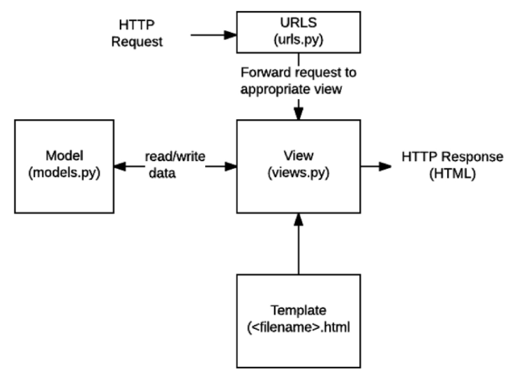

[TOC]

# Django

*The Web framework for perfectionists with deadlines*

## DAY1

### 1. Static web vs Dynamic web

Static web은 미리 저장된 정적파일(HTML, CSS, JS)을 제공합니다. 반면 Dynamic web은 사용자의 요청에 따라 변경사항을 반환해주는 웹입니다. 이러한 동적 웹 기능을 제공하는 것이 Django입니다. 동적인 웹 페이지나, 웹 애플리케이션, 웹 서비스 개발 보조용으로 만들어지는 어플리케이션 프레임워크의 일종입니다. 웹 페이지를 개발하는 과정에서 겪는 어려움을 줄이는 것이 주 목적으로 통상 데이터 베이스 연동, 템플릿 형태의 표준, 세션 관리, 코드 재사용 등의 기능을 포함하고 있습니다. 어플리케이션 프레임워크는 소프트웨어 개발자가 응용 소프트웨어의 표준 구조를 구현하기 위해 사용하는 소프트웨어 프레임워크로 구성됩니다. 즉, 프로그래밍에서 운영체제를 위한 응용 프로그램 표준 구조를 구현하는 클래스와 라이브러리의 모임입니다.

#### What : Python Web framework

python 언어를 기반으로 웹의 기본적인 구조나 필요한 코드를 자동제공합니다.

#### Why : Version and Community

스포티파이, 인스타그램, 드랍박스 등 대규모 애플리케이션에도 사용됩니다. 또한 2013년부터 시작하여 탄탄한 장고 커뮤니티를 지니고 있습니다. 장점으로는 빠르고, 다양한 기능을 제공하고, 안전하고, 스케일어블하다 등의 특징을 지닙니다.

#### How : Model - Template - View, MTV

Django는 파이썬으로 작성된 오픈소스 웹 어플리케이션 프레임워크로, MVC 모델 패턴을 따릅니다. SW공학에서사용되는 MVC 모델 패턴이 있습니다, 이 패턴을 성공적으로 사용하면 사용자 인터페이스로부터 비즈니스 로직을 분리하여 애플리케이션의 시각적 요소나 그 이면에서 실행되는 비즈니스 로직을 서로 영향 없이 쉽게 고칠 수 있는 애플리케이션을 만들 수 있습니다. M : 애플리케이션의 정보(데이터), V : 텍스트, 체크박스 항목 등과 같은 사용자 인터페이스, C : 데이터와 비즈니스 로직 사이의 상호동작을 관리합니다. 장고에서는 `Model - Template - View, MTV` 를 따릅니다. 



> Django 프로젝트를 실행하면, urls - views - templates 순서로 파일을 실행합니다.

### 2. Django Template

DTL(Django template language) 데이터 표현을 제어하는 도구이자 언어 : 조건, 반복, 변수 치환, 필터 등의 기능을 제공합니다. 파이썬처럼 일부 프로그래밍 구조를 사용할 수 있지만 파이썬을 활용하는 것은 아닙니다. 

#### Template syntax

- Variable

  - {{ variable }}

  - render() 를 사용하여 views.py에서 정의한 변수를 template 파일로 넘겨 사용합니다.

  - context 변수에 딕셔너리 형태로 입력합니다.

  - ```
    return render(request, 'greeting.html', context)
    ```

- Filters

  - {{ variable|filter }}

  - 60개의 built-in template filters가 있습니다.

  - ```
    {{ name|lower }}
    ```

- Tags

  - 

  - 출력 텍스트를 만들거나, 반복 또는 논리를 수행하여 제어 흐름을 만드는 일을 수행합니다.

  - ```
    
    
    ```

- Comments

  - {# lorem ipsum #}
  -  

#### Template inheritance

템플릿 상속은 기본적으로 코드의 재사용성에 초점을 맞춥니다. 템플릿 상속을 사용하면 사이트의 모든 공통 요소를 포함하고, 하위 템플릿이 재정의(override) 할 수 있는 블록을 정의하는 기본 스켈레톤 템플릿을 만들 수 있습니다.   부모 템플릿에서 작성, 하위 템플릿에서 재지정할 수 있는 블록을 정의합니다. 즉 하위 템플릿이 채울 수 있는 공간을 말합니다.  자식 템플릿에서 작성, 자식 템플릿이 부모 템플릿을 확장한다는 것을 알립니다. 반드시 템플릿 최상단에 작성해야 합니다. 

1. base.html 생성 및 경로를 작성합니다.

- pjt 폴더 templates/base.html

  -   ```django
     
    
    ```

- settings.py에서 DIR = [BASE_DIR / 'firstpjt' / 'templates', ]
- `` 가장 위에 배치합니다.

#### Template system

"표현(template)과 로직(views)을 분리"합니다. 템플릿 시스템은은 표현을 제어하는 도구이자 표현에 관련된 로직일 뿐입니다. "중복을 배제" 하여 중복 코드를 없애줍니다. 


### 3. Django URLs

#### URL mapping

Dispatcher(발송자) 로서의 URL입니다. 웹 어플리케이션은 URL을 통한 클라이언트의 요청에서부터 시작 됩니다. APP의 view 함수가 많아지면서 사용하는 path() 또한 많아지고, app 또한 더 작성되기 때문에 프로젝트 진행에 따라 app마다 url들을 관리하게 됩니다.

#### Naming URL patterns

링크에 url을 하드 코딩하는 것이 아니라 path() 함수의 name인자를 정의하여 사용합니다. Django Template Tag 중 하나인 url 태그를 사용해서 path() 함수에 작성한 name을 사용할 수 있습니다. url 설정에 정의된 특정한 경로들의 의존성을 제거할 수 있습니다.

- 주소 / 함수명 / 이름을 동일하게 맞추어서 설정합니다.

- `path('index/', views.index, name='index')`
- `<a href=""> 메인 페이지 </a>`


### 4. HTML

##### Form

웹에서 사용자 정보를 입력하는 여러 방식을 제공하고, 사용자로부터 할당된 데이터를 서버로 전송하는 역할을 담당합니다. action : 입력 데이터가 전송될 URL 지정, method : 입력 데이터 전달 방식 지정. 

##### Input

사용자로부터 데이터를 입력 받기 위해 사용합니다. type 속성에 따라 동작 방식이 달라집니다. name : 양식을 제출했을 때 name이라는 이름에 설정된 값을 가져올 수 있음. GET/POST 방식으로 서버에 전달하는 파라미터 형태로 전달합니다.

##### HTTP / HTTPS

Hyper Text Transfer Protocol : 웹에서 이루어지는 모든 데이터 교환의 기초입니다. 주어진 리소스가 수행할 작업을 나타내는 request methods를 정의합니다. GET, POST, PUT, DELETE 등

- GET

서버로부터 정보를 조회하는 데 사용, 데이터를 가져올 때만 사용해야 합니다. 데이터를 서버로 전송할 때 body가 아닌 Query String Parameters를 통해 전송합니다. 서버로부터 HTML 문서 한 장을 받는데 이때 사용하는 요청의 방식이 GET입니다.


### 5. Namespace

이름공간은 객체를 구분할 수 있는 범위를 나타내는 말로 일반적으로 하나의 이름 공간에서는 하나의 이름이 단 하나의 객체만을 가리키게 됩니다. Django는 서로 다른 app의 같은 이름을 가진 url name은 이름공간을 설정해서 구분합니다.

